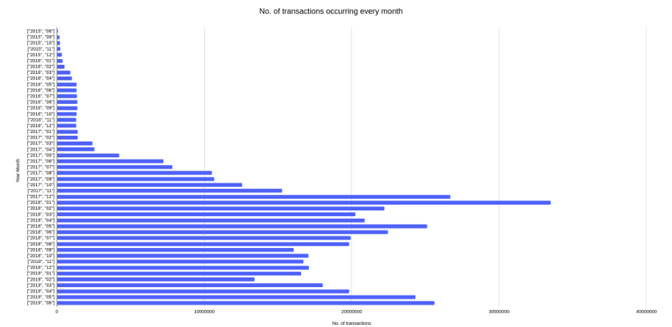
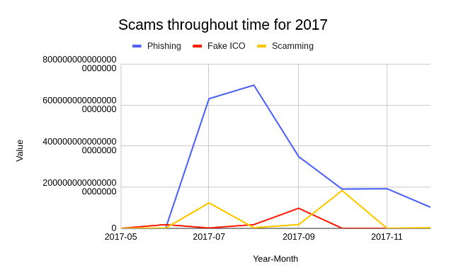
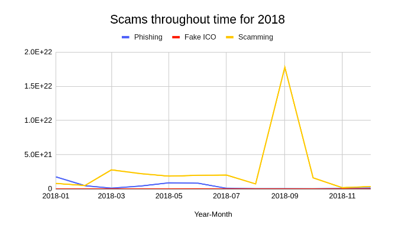
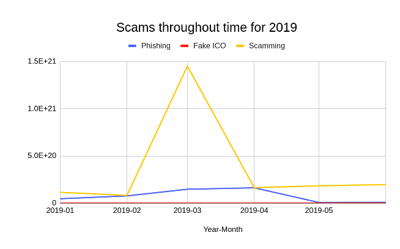
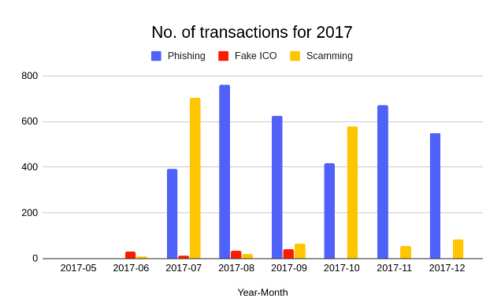
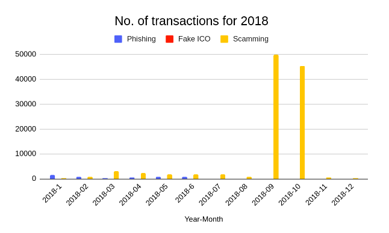
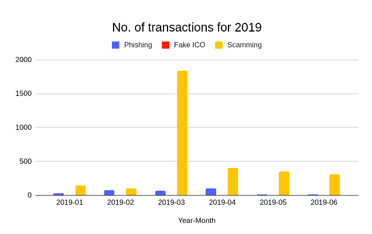

# Ethereum_Analysis
## Analysis of Ethereum transactions and Smart Contracts

The goal of this coursework is to apply the techniques covered in the first half of Big Data Processing to analyse the full set of transactions which have occurred on the Ethereum network; from the first transactions (14-02-2016) till 30-06-2019. 

### DATASET OVERVIEW

Ethereum is a blockchain based distributed computing platform where users may exchange currency (Ether), provide or purchase services (smart contracts), mint their own coinage (tokens), as well as other applications. The Ethereum network is fully decentralised, managed by public-key cryptography, peer-to-peer networking, and proof-of-work to process/verify transactions.

A subset of the data available on BigQuery is provided at the HDFS folder. The blocks, contracts and transactions tables have been pulled down and been stripped of unneeded fields to reduce their size. There is set of scams, both active and inactive, run on the Ethereum network via etherscamDB which is available on HDFS.

DATASET SCHEMA - BLOCKS

number: The block number

hash: Hash of the block

miner: The address of the beneficiary to whom the mining rewards were given

difficulty: Integer of the difficulty for this block

size: The size of this block in bytes

gas_limit: The maximum gas allowed in this block

gas_used: The total used gas by all transactions in this block

timestamp: The timestamp for when the block was collated

transaction_count: The number of transactions in the block

+-------+--------------------+--------------------+----------------+-----+---------+--------+----------+-----------------+
| number|                hash|               miner|      difficulty| size|gas_limit|gas_used| timestamp|transaction_count|
+-------+--------------------+--------------------+----------------+-----+---------+--------+----------+-----------------+
|4776199|0x9172600443ac88e...|0x5a0b54d5dc17e0a...|1765656009004680| 9773|  7995996| 2042230|1513937536|               62|
|4776200|0x1fb1d4a2f5d2a61...|0xea674fdde714fd9...|1765656009037448|15532|  8000029| 4385719|1513937547|              101|
|4776201|0xe633b6dca01d085...|0x829bd824b016326...|1765656009070216|14033|  8000000| 7992282|1513937564|               99|
|4776202|0x2ec4b8235923a59...|0x52bc44d5378309e...|1765656009102984|29386|  8000029| 7851362|1513937573|              238|
|4776203|0x41f604b680e98d9...|0xea674fdde714fd9...|1765656009135752|28954|  8000029| 7608807|1513937582|              218|
|4776204|0x5cbbf6a7d477d8e...|0x52bc44d5378309e...|1766518145891730|21030|  8000029| 7851625|1513937587|              168|
|4776205|0xbfc7b7c3e60871d...|0x5a0b54d5dc17e0a...|1767380703612921|14168|  7992222| 7835129|1513937591|              103|
|4776206|0x753989a3805ef53...|0xea674fdde714fd9...|1765654745927319|29125|  7999992| 7989266|1513937624|              217|
|4776207|0x6f05105a6f8bc79...|0x829bd824b016326...|1767379018172905|27294|  8003884| 7996284|1513937632|              199|
|4776208|0x0f4a563b90f8dfe...|0xea674fdde714fd9...|1768241996241890|17090|  8000029| 7981114|1513937636|               67|
|4776209|0x5d62c54adb1cf9f...|0x829bd824b016326...|1769105395686885|31756|  8003909| 7999420|1513937646|              152|
|4776210|0x61f378b94ee93e5...|0xea674fdde714fd9...|1769105395719653|17215|  8000029| 4861724|1513937661|               93|
|4776211|0xaf0bd62dbb54a5f...|0xb2930b35844a230...|1769969216746424|22572|  8000029| 7980777|1513937667|              107|
|4776212|0xc378e5b0cb56015...|0x6a7a43be33ba930...|1766512245652736|32834|  8000029| 7981744|1513937718|              194|
|4776213|0x70a7e0f71e4ae02...|0xea674fdde714fd9...|1763924581263163|37277|  8000029| 7992002|1513937761|              255|
|4776214|0xfb19cfa052d0f9f...|0xea674fdde714fd9...|1764785872595375|13740|  8000029| 4704474|1513937763|               72|
|4776215|0x2d127b5cbc681c0...|0xb75d1e62b10e4ba...|1765647584479996|26482|  7992222| 6630351|1513937767|              163|
|4776216|0xc4e242278d153b5...|0xb2930b35844a230...|1766509717122373|18248|  7984452| 7965327|1513937774|               76|
|4776217|0xde24c6f461a79da...|0x829bd824b016326...|1765647163582328|31649|  7992248| 7986059|1513937796|              180|
|4776218|0x1689f0d2ea89886...|0xea674fdde714fd9...|1767371428423280|25953|  8000029| 7415731|1513937802|              146|

DATASET SCHEMA - TRANSACTIONS

block_number: Block number where this transaction was in

from_address: Address of the sender

to_address: Address of the receiver. null when it is a contract creation transaction

value: Value transferred in Wei (the smallest denomination of ether)

gas: Gas provided by the sender

gas_price : Gas price provided by the sender in Wei

block_timestamp: Timestamp the associated block was registered at (effectively timestamp of the transaction)

+------------+--------------------+--------------------+-------------------+------+-----------+---------------+
|block_number|        from_address|          to_address|              value|   gas|  gas_price|block_timestamp|
+------------+--------------------+--------------------+-------------------+------+-----------+---------------+
|     6638809|0x0b6081d38878616...|0x412270b1f0f3884...| 240648550000000000| 21000| 5000000000|     1541290680|
|     6638809|0xb43febf2e6c49f3...|0x9eec65e5b998db6...|                  0| 60000| 5000000000|     1541290680|
|     6638809|0x564860b05cab055...|0x73850f079ceaba2...|                  0|200200| 5000000000|     1541290680|
|     6638809|0x8e5bb92b98c0cf4...|0x9eec65e5b998db6...|                  0| 60000| 5000000000|     1541290680|
|     6638809|0x6908856f565e5b6...|0x9eec65e5b998db6...|                  0| 60000| 5000000000|     1541290680|
|     6638809|0x00cdc153aa8894d...|0x8d5a0a7c555602f...| 984699000000000000|940000| 5000000000|     1541290680|
|     6638809|0x71e5e2114561d30...|0xe36df5bb57e8062...|                  0| 60000| 5000000000|     1541290680|
|     6638809|0x9cbbc2c728863d9...|0x9eec65e5b998db6...|                  0| 60000| 5000000000|     1541290680|
|     6638809|0x33ca0295811747f...|0x9eec65e5b998db6...|                  0| 60000| 5000000000|     1541290680|
|     6638809|0xbcf32771090aecb...|0x32623916bd5e735...| 257315840000000000| 21000| 5000000000|     1541290680|
|     6638809|0xc21a44550926c9a...|0x9eec65e5b998db6...|                  0| 60000| 5000000000|     1541290680|
|     6638809|0x405353c90852e9c...|0x9eec65e5b998db6...|                  0| 60000| 5000000000|     1541290680|
|     6638810|0xeee28d484628d41...|0x8dd5fbce2f6a956...|                  0| 90000|64000000000|     1541290720|
|     6638810|0x96f9706e01caba2...|0x490c95be16384e1...|                  0| 37804|50100000000|     1541290720|
|     6638810|0xca83c8e5ff93fa0...|0x5bc8854dd4a7d5b...|2292738000000000000| 21000|41000000000|     1541290720|
|     6638810|0xf73c3c65bde10bf...|0x13e8640a2f06ef1...|1000000000000000000|400000|40000000000|     1541290720|
|     6638810|0x2cefcf6a903d863...|0xd9c8ae68aa8ff1f...|                  0|200000|33000000000|     1541290720|
|     6638810|0x521db06bf657ed1...|                null|                  0|210000|32608136662|     1541290720|
|     6638810|0x3f5ce5fbfe3e9af...|0xdf2c7238198ad8b...|                  0| 75138|30000000000|     1541290720|
|     6638810|0x3f5ce5fbfe3e9af...|0xdf2c7238198ad8b...|                  0| 75138|30000000000|     1541290720|

DATASET SCHEMA - CONTRACTS
address: Address of the contract

is_erc20: Whether this contract is an ERC20 contract

is_erc721: Whether this contract is an ERC721 contract

block_number: Block number where this contract was created

+--------------------+--------+---------+------------+--------------------+
|             address|is_erc20|is_erc721|block_number|     block_timestamp|
+--------------------+--------+---------+------------+--------------------+
|0x9a78bba29a2633b...|   false|    false|     8623545|2019-09-26 08:50:...|
|0x85aa7fbc06e3f95...|   false|    false|     8621323|2019-09-26 00:29:...|
|0xc3649f1e59705f2...|   false|    false|     8621325|2019-09-26 00:29:...|
|0x763fe69be6c6ec1...|   false|    false|     8621263|2019-09-26 00:16:...|
|0xcd05b1405efa69f...|   false|    false|     8621206|2019-09-26 00:05:...|
|0xdeb220a2403e653...|   false|    false|     5363203|2018-04-01 21:23:...|
|0x0de0e9971ad93b3...|   false|    false|     5359109|2018-04-01 05:10:...|
|0x58c38ad83417e7b...|   false|    false|     5362728|2018-04-01 19:37:...|
|0xadce4fe9b3c2ed0...|   false|    false|     5362995|2018-04-01 20:39:...|
|0x6fe77efba17afa5...|   false|    false|     5363518|2018-04-01 22:49:...|
|0x391db5cb42e918b...|   false|    false|     5359958|2018-04-01 08:35:...|
|0x61d0e4402996bd3...|   false|    false|     5358721|2018-04-01 03:37:...|
|0x356db362d67e065...|   false|    false|     5359534|2018-04-01 06:56:...|
|0x80c676fbba74643...|   false|    false|     5363162|2018-04-01 21:12:...|
|0x2f73ea1b261dfa7...|   false|    false|     5358309|2018-04-01 02:04:...|
|0x8bdb0567c9db489...|   false|    false|     5359093|2018-04-01 05:05:...|
|0x128e9904959629d...|   false|    false|     5357919|2018-04-01 00:30:...|
|0x1d601b70f3d8489...|   false|    false|     8377968|2019-08-19 01:43:...|
|0xc0ce6542be0df27...|   false|    false|     8378020|2019-08-19 01:54:...|
|0xdb98e880a574766...|   false|    false|     8380961|2019-08-19 13:01:...|
DATASET SCHEMA - SCAMS.JSON
id: Unique ID for the reported scam

name: Name of the Scam

url: Hosting URL

coin: Currency the scam is attempting to gain

category: Category of scam - Phishing, Ransomware, Trust Trade, etc.

subcategory: Subdivisions of Category

description: Description of the scam provided by the reporter and datasource

addresses: List of known addresses associated with the scam

reporter: User/company who reported the scam first

ip: IP address of the reporter

status: If the scam is currently active, inactive or has been taken offline

0x11c058c3efbf53939fb6872b09a2b5cf2410a1e2c3f3c867664e43a626d878c0: {
    id: 81,
    name: "myetherwallet.us",
    url: "http://myetherwallet.us",
    coin: "ETH",
    category: "Phishing",
    subcategory: "MyEtherWallet",
    description: "did not 404.,MEW Deployed",
    addresses: [
        "0x11c058c3efbf53939fb6872b09a2b5cf2410a1e2c3f3c867664e43a626d878c0",
        "0x2dfe2e0522cc1f050edcc7a05213bb55bbb36884ec9468fc39eccc013c65b5e4",
        "0x1c6e3348a7ea72ffe6a384e51bd1f36ac1bcb4264f461889a318a3bb2251bf19"
    ],
    reporter: "MyCrypto",
    ip: "198.54.117.200",
    nameservers: [
        "dns102.registrar-servers.com",
        "dns101.registrar-servers.com"
    ],
    status: "Offline"
},


### PART A. TIME ANALYSIS

<u>Create a bar plot showing the number of transactions occurring every month between the start and end of the dataset.</u>

The month with the highest number of transactions was 2018-01 with a total of 33,504,270
transactions. The rest of transactions for each month can be appreciated in the following bar plot:



### PART B. TOP TEN MOST POPULAR SERVICES

</u>Evaluate the top 10 smart contracts by total Ether received.</u>

```
0xaa1a6e3e6ef20068f7f8d8c835d2d22fd5116444	84155100809965865822726776
0xfa52274dd61e1643d2205169732f29114bc240b3	45787484483189352986478805
0x7727e5113d1d161373623e5f49fd568b4f543a9e	45620624001350712557268573
0x209c4784ab1e8183cf58ca33cb740efbf3fc18ef	43170356092262468919298969
0x6fc82a5fe25a5cdb58bc74600a40a69c065263f8	27068921582019542499882877
0xbfc39b6f805a9e40e77291aff27aee3c96915bdd	21104195138093660050000000
0xe94b04a0fed112f3664e45adb2b8915693dd5ff3	15562398956802112254719409
0xbb9bc244d798123fde783fcc1c72d3bb8c189413	11983608729202893846818681
0xabbb6bebfa05aa13e908eaa492bd7a8343760477	11706457177940895521770404
0x341e790174e3a4d35b65fdc067b6b5634a61caea	8379000751917755624057500
```

### PART C. DATA EXPLORATION
#### Popular Scams: 
Utilising the provided scam dataset, what is the most lucrative form of scam based on value transferred in Wei (the smallest denomination of ether)?

```
"Scamming" 38407781260421703730344
"Phishing" 26927757396110618476458
"Fake ICO" 1356457566889629979678
```
How does this change throughout time? 





How many transactions were made to each scam address throughout time?


